<h1 align="center">Hey there👋, I'm Lukas</h1>

Check out our custom CPU: [Shade-1](https://github.com/rtbnb/SixteenShadesOfCpu)

I'm currently working on: [Custom Scanning Electron Microscope](https://github.com/LukasReil/SEM_Dev)

----------
Contact me:

<!--
**LukasReil/LukasReil** is a ✨ _special_ ✨ repository because its `README.md` (this file) appears on your GitHub profile.

Here are some ideas to get you started:

- 🔭 I’m currently working on ...
- 🌱 I’m currently learning ...
- 👯 I’m looking to collaborate on ...
- 🤔 I’m looking for help with ...
- 💬 Ask me about ...
- 📫 How to reach me: ...
- 😄 Pronouns: ...
- ⚡ Fun fact: ...
-->
